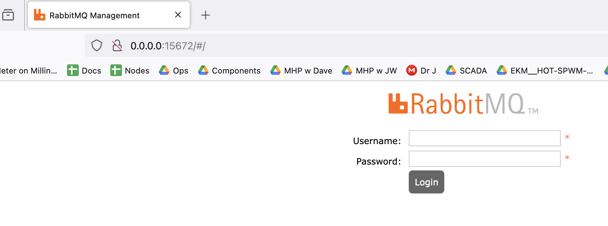

# Gridworks

[][pypi_]
[][status]
[][python version]
[][license]

[][read the docs]
[][tests]
[][codecov]

[][pre-commit]
[][black]

[pypi_]: https://pypi.org/project/gridworks/
[status]: https://pypi.org/project/gridworks/
[python version]: https://pypi.org/project/gridworks
[read the docs]: https://gridworks.readthedocs.io/
[tests]: https://github.com/thegridelectric/gridworks/actions?workflow=Tests
[codecov]: https://app.codecov.io/gh/thegridelectric/gridworks
[pre-commit]: https://github.com/pre-commit/pre-commit
[black]: https://github.com/psf/black

These days, more and more electrical power is coming from highly variable power sources such as wind and solar. And yet, the number of electrons going into the grid must match the number coming out: at every timescale, and at every geographic scale. Since the days of Tesla and Edison, this balancing job has been accomplished with central control and dispatch over hydrocarbon-burning generators. 

GridWorks is a technology ecosystem inspired by the idea of a new role for electric loads on the grid.  Why not design our appliances so they are alert to grid conditions, consume lots of energy when it is abundant, and can support grid balancing?  This shift in the framework of how loads interact with the grid helps people receive a very specific sort of abundance: low-cost, low-carbon electricity that would otherwise go to waste.

Places to start:

- Most GridWorks information exchange is asynchronous message passing, brokered by RabbitMQ. The first step in learning and developing is to set up a dev rabbit broker with the correct plumbing. Do this by downloading the [GridWorks repository](https://github.com/thegridelectric/gridworks) and follow the instructions below on [RabbitMQ](#rabbitmq-infrastructure).
- Read the [Millinocket Story](https://gridworks.readthedocs.io/en/latest/millinocket-demo.html) to understand the natural match between wind power and space heating.
- Go through the partner [Millinocket Tutorial](https://gridworks.readthedocs.io/en/latest/millinocket-tutorial.html) to start understanding how GridWorks open-source technology can be used to build economics and physics tools allowing self-organized groups of people -- at many scales -- to connect the gift of low-carbon, low-cost electricity with the need of keeping people warm in the winter.

## GridWorks SDKs

- **gridworks**: [package](https://pypi.org/project/gridworks/) provides basic shared mechanics for communication and GNode structure. It is used as a package in all of our other repos.

- **gridworks-atn**: [package](https://pypi.org/project/gridworks-atn/) and associated [documentation](https://gridworks-atn.readthedocs.io/en/latest/) for the GridWorks Python [AtomicTNodes](https://gridworks.readthedocs.io/en/latest/atomic-t-node.html) SDK. AtomicTNodes are the GridWorks actors that make electrical devices _transactive_. This SDK is a great place to learn about blockchain mechanics, as it introduces some of the simpler structures (NFTs, stateless contracts, and then some simple stateful smart contracts constructed using [beaker](https://github.com/algorand-devrel/beaker) ) required for establishing the link between physical reality on the electric grid and the actors that play their avatars in GridWorks.

- **gridworks-marketmaker**: [package](https://pypi.org/project/gridworks-marketmaker/) and associated [documentation](https://gridworks-marketmaker.readthedocs.io/en/latest/) for our Python [MarketMaker](https://gridworks.readthedocs.io/en/latest/market-maker.html) SDK. GridWorks uses distributed actors to balance the electric grid, and MarketMakers are the actors brokering this grid balancing via the markets they run for energy and balancing services.

There are several other open source GridWorks repos to explore on [our github page](https://github.com/thegridelectric),
including the code running on the [SCADA systems](https://github.com/thegridelectric/gw-scada-spaceheat-python)
that Efficiency Maine is deploying in Millinocket this winter.
The [GNodeFactory](https://github.com/thegridelectric/g-node-factory) currently hosts the demo,
and does most of the heavy lifting in terms of identity management and authentication in GridWorks. Finally, since the demo
is a distributed simulation, it needs a method of handling time. That's done by a [TimeCoordinator](https://github.com/thegridelectric/gridworks-timecoordinator) GNode.

## RabbitMQ Infrastructure

All GridWorks repos require a running rabbitMQ dev broker running to pass tests or run dev simulations.  Instructions for setting it up:

  - Make sure you have [docker](https://www.docker.com/products/docker-desktop/) installed
  - Know whether your computer architecture is x86 or arm
  - Start the dev broker in a docker container:
    - **x86 architecture**: `./x86.sh`
    - **arm architecture**: `./arm.sh`
  - Tests for success:
    1) go to http://0.0.0.0:15672/ - it should look like this:

    2) pytest tests should all passs

Username/password for the dev rabbit broker: `smqPublic/smqPublic`

The [Gridworks broker](docs/gridworks-broker) page has more information on the GridWorks brokers and how to use them for troubleshooting, 

## Contributing

Contributions are very welcome. 
To learn more, see the [Contributor Guide].

## License

Distributed under the terms of the [MIT license][license],
_Gridworks_ is free and open source software.

## Issues

If you encounter any problems,
please [file an issue] along with a detailed description.

## Credits

This project was generated from [@cjolowicz]'s [Hypermodern Python Cookiecutter] template.

[@cjolowicz]: https://github.com/cjolowicz
[pypi]: https://pypi.org/
[hypermodern python cookiecutter]: https://github.com/cjolowicz/cookiecutter-hypermodern-python
[file an issue]: https://github.com/thegridelectric/gridworks/issues
[pip]: https://pip.pypa.io/

<!-- github-only -->

[license]: https://github.com/thegridelectric/gridworks/blob/main/LICENSE
[contributor guide]: https://github.com/thegridelectric/gridworks/blob/main/CONTRIBUTING.md
[command-line reference]: https://gridworks.readthedocs.io/en/latest/usage.html
