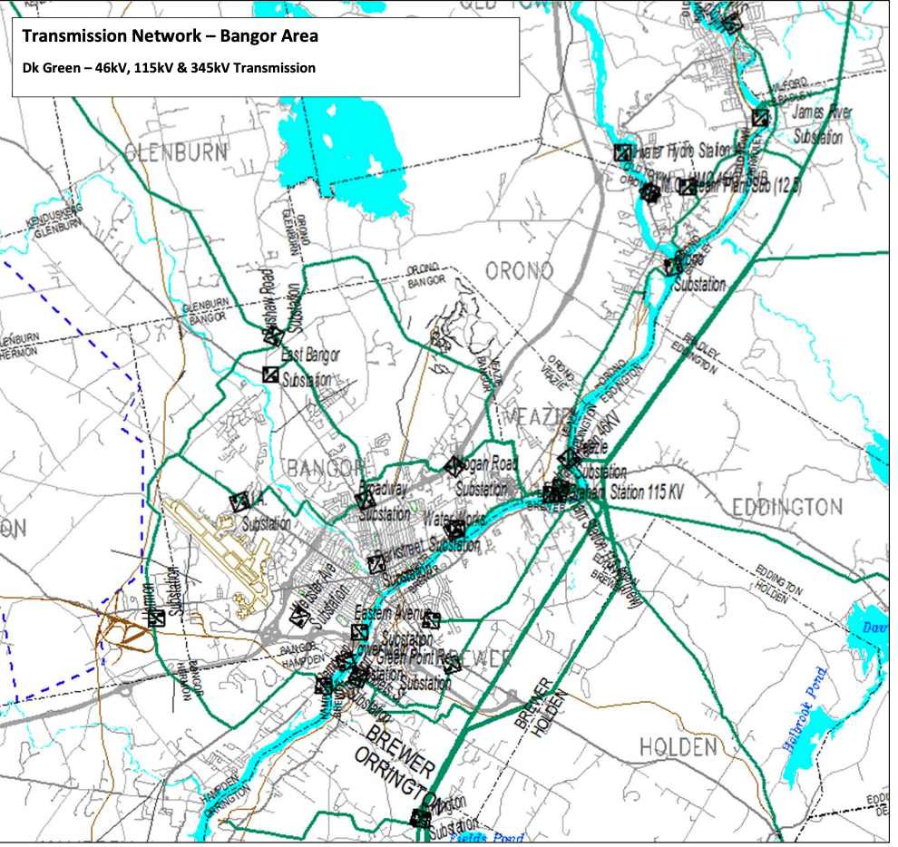

# Discoverer

A **Discoverer** is an entity with an Algorand address who solicits
the creation of a new ConductorTopologyNode from the GNodeFactory.

The mechanism for adding new ConductorTopologyNodes to the GNodeFactory
is still a work in progress. It will likely involve providing data
(for example, a utility map like the one below, with annotations)
about the location of a new ConductorTopologyNode in relation to
known existing ConductorTopologyNodes, as well as a period
where this information can be reviewed and/or challenged.

The Discoverer will likely be issued a DiscoveryCertificate to
acknowledge their contribution to mapping out the grid.

_Back to [Lexicon](lexicon)_
