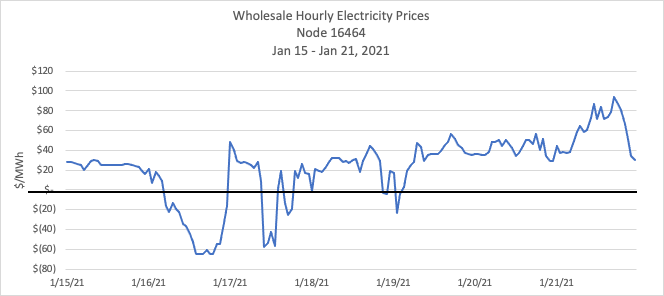

# Economics of the Electric Grid

## Supply and Demand

**Load** on the electic grid is an overloaded word: it can mean devices that
consume electricity, it can mean instantaneous power withdrawn from the grid,
and it can mean energy withdrawn from the grid over a period of time.

In this section, we are going to focus on the economics of the electric grid and of energy markets, and redefine generation as “supply” and load as “demand,” in the classic economic sense of supply and demand in a market.

This is a felicitous definition, because just like in the physics of the grid where Generation must equal Load, in economics Supply must equal Demand.

Prior to the deregulation of electricity markets in the US in the 1980s, large electric utilities were vertically integrated, owning the entire grid from generators (and sometimes even coal mines) to the electric meter attached to the outside of your house. These utilities kept the grid in balance by dispatching their own generators so that generation = load.

With deregulation, which required the electric utilities to divest themselves of their generation assets, new entities had to be created to keep the grid in balance. These entities – variously called Independent System Operators (ISOs), Regional Transmission Organizations (RTOs) or simply Grid Operators – make sure that generation = load using different mechanisms depending on the timescale over which the grid balancing needs to occur. On all timescales at or above 5 minutes, these Grid Operators run wholesale markets that insure that generation = load by making sure that supply = demand.

### Generation and existing markets

The way that Grid Operators run these wholesale markets is as follows. Each Generator submits bids to the Grid Operator in advance committing to deliver a certain quantity of generation at any given price. This might be a simple as “If the price goes above $75 per MWh, I will deliver my full output of 150 MW. Below this price I will generate nothing” or it might be more complex: “At any price below $50 per MWh, I will generate nothing; between $50 and $75, I will generate 100 MW, above $75 I will generate my full output of 150 MW.”

In general the bids that Generators submit depend on what type of fuel they use, the price of this fuel, and the type of plant that the Generator operates. For reasons that will be explained below, Generators have incentives to make bids that reflect their true marginal cost of generation.

The Grid Operator gets all of these bids and sorts them by price, and then “stacks them up” to create a “Bid Stack” or aggregate supply curve. These supply curves look like this:

This Bid Stack represents the relationship between the price of electricity set by the Grid Operator and aggregate amount of energy that Generators will be willing to supply in any hour. Using this bid stack, and using its forecast for Load in each hour, the Grid Operator can set a price for electricity in each hour that will exactly match Supply with Demand, or Generation with Load.

The result is a time-varying price for electricity that is higher when demand is high, and lower when demand is low. This is because in hours with high demand, grid operators need to set a higher price in order to induce higher-cost generators to come online.

- It is important to to note that all generators get paid the price that is paid to the generator with the highest bid accepted into the market, regardless of their own bid.
- It is for this reason that bidders will bid based on their true marginal costs: their bid is only used to determine whether they get accepted into the market, not how much they get paid.

### Load and existing markets

Note that nowhere in this story is there any notion that the amount of energy demanded in an hour – that is, the amount of Load – might depend on the price of electricity. Virtually every grid in the world assumes that demand for electricity is entirely “inelastic.”

This assumption is largely correct: few electricity consumers pay the time-varying cost for electricity. Rather this volatility is “averaged out” by their Energy Supplier, allowing them not to worry about what electricity might cost this hour, and robbing them of the opportunity, which they have with almost everything else that they buy, to economize on electricity use when it is expensive, and use more of it when it is cheap.

## Zero marginal cost generation

What Happens When the Marginal Cost of Generation is Zero? How will a Wind Generator, whose marginal cost of generation is zero, bid into energy markets?

The simple answer is, they will agree to turn on their wind turbines whenever the offered electricity price is greater than zero. Same with a solar farm.

The actual answer is not quite this simple. Because renewable energy is subsidized by state and federal governments in the US (and many other places in the world) on a per kWh basis regardless of how much the energy is worth on the grid, renewables generators have an incentive to keep on generating even if the price of electricity paid by the grid operator is zero. In fact, in order for the grid operator to get a renewables generator to turn off their plants, they must charge the generators (that is set a negative price for electricity) an amount larger than the size of the government subsidy.

The result of this is that, in places where there is a lot of renewable generation wholesale, prices for electricity routinely fall below zero when renewable generation is high. The graph below shows hourly wholesale electricity prices for one week at a location east of Millinocket Maine, near two of the largest wind farms in New England.

Those hours on the 16th, 17th, and 19th of January when prices go negative are periods when wind energy is being shut down – curtailed – by the New England Grid Operator. The amount of locally-generated wind energy exceeds the load during those hours, and the wind farms need to be curtailed to protect equipment from being overloaded.

Note that, as long as load on the electric grid is entirely price inelastic, there will be no response to this cheap, abundant, and wasted renewable energy.
