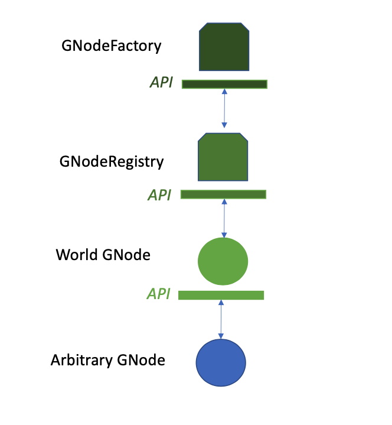

GNodeFactory
=============

The GNodeFactory is responsible for
the topology of the GNodeTree - and importantly its copper sub-tree. It also managing
the process of creating and updating Algorand certificates (TaDeeds, TaTradingRights,
DiscoveryCertificates). This provides the foundation for scalable, trustless verification
of the bijection between online avatars and their real-life partners
(e.g. `TerminalAssets <terminal-asset.html>`_ <-> `Transactive Device <transactive-device.html>`_).
This validation process uses the `Algorand blockchain <blockchain.html>`_.

There are several layers of indirection between an arbitrary GNode and the GNodeFactory.

A unique World GNode sitting at the top of a World's GNodeTree and -- for its descendants -- acts as
the Single Source of Truth (SSoT) for updates related to the GNodeTree and associated data. Under
the hood, the World GNode's actor is responsible for managing the applications representing the
GNodes in that World (captured by the concept of `GNodeInstance <g-node-instance.html>`_).

The  GNodeFactory also manages WorldInstances. This allows for multiple simulations to run that share
the same GNodeTree. Scenarios where actual money changes hands (e.g., using the Algorand Mainnet
instead of TestNet or sandbox) occur in the production universe. To prevent the obvious potential
issue of double-counting, there is only one WorldInstance in the production universe.

Although the GNodeFactory spawns WorldInstances, a World's GNode actor does not directly communicate
with the GNodeFactory. This is because the GNodeFactory does not track all of the relevant information
about GNodes. For example, detailed information about a GNode's associated Physical Device is not
managed by the GNodeFactory.

In order to get its information about a specific GNode, therefore, the World GNode actor communicates
with the `GNodeRegistry <g-node-registry.html>`_ for that GNode. The GNodeRegistry is the authority for
certain kinds of information that the GNodeFactory does not track. Under the hood, that GNodeRegistry
communicates with  the (unique) GNodeFactory in that universe for key topological
and identity information.

The open-souce repository for the GNodeFactory can be found `here <https://github.com/thegridelectric/g-node-factory>`_.

GNfAdminAddr
^^^^^^^^^^^^^^

GnfAdminAddr is the primary Algorand address associated to the GNodeFactory. This address is used in
numerous validation checks for GridWorks types.  It is available as an environment variable.

.. code-block:: python
   :caption: Inspect the dev universe GnfAdminAddr

   from gridworks.gw_config import Public

   gnf_admin_addr = Public().gnf_admin_addr
   assert gnf_admin_addr ==  "RNMHG32VTIHTC7W3LZOEPTDGREL5IQGK46HKD3KBLZHYQUCAKLMT4G5ALI"

Note that the GNodeFactory is designed to be unique. However, as a developer, you can run
GridWorks simulations on your laptop, with no Internet.  GridWorks has the concept
of `Universe <universe.html>`_, which can be Dev, Hybrid or Production. Each of these has a unique
GnfAdminAddr.

TaValidatorFundingThresholdAlgos
^^^^^^^^^^^^^^^^^^^^^^^^^^^^^^^^^^
In order to be certified as a `TaValidator <ta-validator.html>`_, an entity must put enough
skin in the game to show that they are serious about doing TerminalAsset validations. They
are required to fund their 2-sig Multi [GnfAdminAddr, TaValidatorAddr] with this amount.
In the `Dev Universe <universe.html>`_, this is set to 100 Algos.

.. code-block:: python
   :caption: Inspect dev TaValidatorFundingThesholdAlgos

   from gridworks.gw_config import Public

   threshold = Public().ta_validator_funding_threshold_algos
   assert threshold ==  100

TaDeedConsiderationAlgos
^^^^^^^^^^^^^^^^^^^^^^^^^
A TaOwner must fund their TaDaemonAddr with an initial consideration in order to receive
their initial TaDeed and TaTradingRights (or more accurately, for the TaDaemonAddr to receive
these). This account will be actively involved in transactions with an AtomicTNode as
the AtomicTNode transacts on behalf of the TerminalAsset in markets. Prior to entering into
markets, initial requirements may be made about the funding level of the TaDaemonAddr - roughly
equivalent to the energy costs incurred by a month of trading activity.

In the `Dev Universe <universe.html>`_, the TaDeedConsiderationAlgos is set to 50 Algos.

.. code-block:: python
   :caption: Inspect dev TaValidatorFundingThesholdAlgos

   from gridworks.gw_config import Public

   threshold = Public().ta_deed_consideration_algos
   assert threshold ==  50

Back to `Lexicon <lexicon.html>`_
