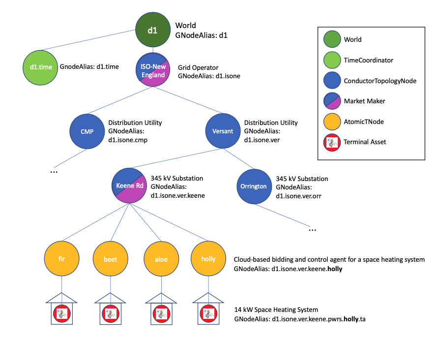

GNode
-----

A **GNode** is the fundamental building block of GridWorks. The `G` stands for grid.

Many of the lead roles in the `demo <story.html>`_ are GNodes: the
`SCADA <scada.html>`_, the `TerminalAsset <terminal-asset.html>`_,
the `MarketMaker <market-maker.html>`_ and the `AtomicTNodes <atomic-t-node.html>`_.

Copper GNodes
^^^^^^^^^^^^^^^^
The electric grid can be reasonably well modeled as a graph, where an edge in the
graph represent a copper wire and cable with relatively uniform electrical characteristics
(mainly no sudden intentional change in voltage via a transformer) and the nodes in the
graph represent places where two or more edges meet. Note that an electrical device
attached to the electric grid can also usually meet the characteristics of an *edge*,
where one endpoint is electrical ground.

Edison originally made a bunch of local DC powerplants, and transmit low-voltage DC to
businesses and homes. This is what he made in New York City.

Tesla proposed an alternative system that involved alternating current (AC) generation and
transformation. This allowed for high-voltage transmission.

Edison's grid had generators everywhere, Tesla's (which is what we have implemented) has
substations and other transformers everywhere.

What this means is there is a natural hierarchy on our AC grid based on voltage.

We start out with a set of what we call **Copper GNodes** which represent a subset of
the nodes in this copper graph. We then create a **spanning tree**  that tracks the
natural hierarchy of voltage on the grid. While the electric grid does have loops,
it doesn't actually have that many - put another way, the edges of this spanning tree
capture *most* of the edges in the graph. We capture the remaining edges by turning
them into additional GNodes with GNodeRole InterconnectionComponent.

In SDK:

  - TODO: hyperlink to GNode dataclass inside the SDK  `Data Classes <data-classes.html>`_
  - TODO: hyperlink to GNodeGt inside the SDK `Types <types.html>`_

BaseGNodes
^^^^^^^^^^^^
The Copper GNodes have the GNodeFactory as their global authority. The remaining GNodes
have various GNodeRegistries as their global authority.

The GNodeFactory does not maintain or track information about the devices themselves -
this is done in the GNodeRegistry.

This level of abstraction is implemented by creating BaseGNodes, which are the objects
that the GNodeFactory authorizes and maintains, and creating GNodes, which are a small
extension of BaseGNodes.
