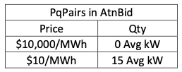
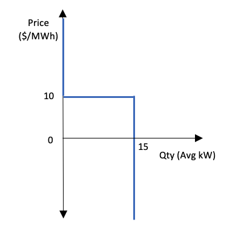

# MarketMaker

A **MarketMaker** is a Copper GNode that runs an electricity market. MarketMaker is an essential [GNodeRoles](g-node-role.rst) in GridWorks: a hierarchy of MarketMakers is responsible for coordinating Transactive Devices in a way that respects the
copper constraints on the grid and turns these transactive devices into balancing resources. A simple open-source MarketMaker available on [github](https://github.com/thegridelectric/gridworks-marketmaker)
is used in the [Millinocket tutorial](millinocket-tutorial).

## How AtomicTNodes bid

If you are "bidding into an the energy market" - whether run by the New England Grid Operator or a GridWorks MarketMaker - the bid is about energy consumed or provided over a _specific interval of time_.
An AtomicTNode providing a bid to a MarketMaker is bidding into a MarketSlot. The MarketSlot
specifies:

- The start time
- The MarketType (determines properties shared with other MarketSlots of the same MarketType)
- The Alias of the MarketMaker GNode

The Atn provides its bid via the GridWorks type [atn.bid](https://gridworks-atn.readthedocs.io/en/latest/apis/types.html#atnbid).
We explain what is going on in this bid.
We will work an example below with the MarketMaker for the Keene Rd constraint in the [Millinocket demo](millinocket-demo).
This MarketMaker has a _single_ MarketType, which means for example that the question "what is current Keene Rd price?" is well-formed,
since at any time there is only one MarketSlot containing that time.

The `d1.isone.me.ver.keene` MarketType is for hourly real-time energy. Bids to a MarketSlot stop being accepted 5 minutes before
the start of the MarketSlot. The price units are UsdPerMWh and the quantity units are AvgkW. Lastly, there is a global upper bound of $10,000 UsdPerMwh on price. It is identified globally within GridWorks by the string `rt60gate30b`.

Let's examine a Millinocket [AtomicTNode](atomic-t-node) (ATN) bidding into the Keene Rd MarketMaker's `rt60gate30b` MarketSlot starting at 5 am Jan 2020 UTC.

This list of pairs defines quantity as a function of price. For all pairs [`P`,`Q`] in the PqPairs list:

- [**Price p**]: For any price p below `P` (in $ per MWh), down to the next listed price (if any)
- [**Quantity as fn of Price p**]: I will consume (or demand) on average `Q` kWs in this MarketSlot.

Here is a graph of this function:

Each MarketType has a maximum price PMax; `rt60gate30b` has a PMax of $10,000/MWh. While this price is arbitrary, it is necessary to specify a maximum. Specifically, the Price in the _first pair_ of PqPairs must be PMax.

This, therefore, is the bid that an electric heating system would submit to express that it will want to turn on full (15 kW) if the price is at or below $10/MWh, and otherwise it will turn off.

_Back to [Lexicon](lexicon)_
