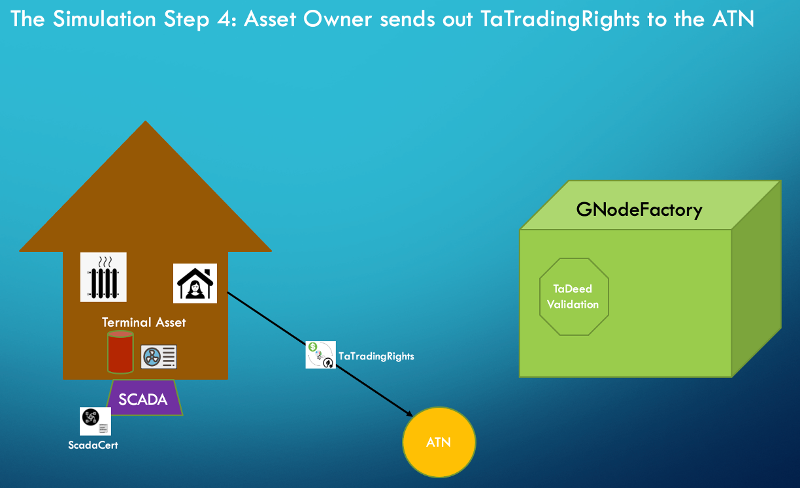

# Millinocket Demo

This is an explanation and summary of the results of a 10 MW Transactive Heating demo, simulating
400 heat pump thermal storage Transactive Devices in Millinocket Maine.

## Background
In the hills east of Millinocket Maine are two of the largest wind farms in New England. The electric grid is not very robust in this remote part of the state, and as a result on windy days, the grid cannot handle all of the energy being generated by the Stetson and Rollins Wind Projects. 

Electric Grid Around Millinocket Maine

When this happens the regional grid operator, ISO New England, sets the price of electricity very low (often -$40 or lower) in order to induce the two wind farms to "curtail" their output so as not to overload the substation at Keene Road.

Keene Road Substation

These curtailment events are not rare. In 2021, the wholesale price of electricity (called the Locational Marginal Price) at Keene Road was negative 30% of the hours during the windy winter months.

Meanwhile, people around Millinocket are shivering, turning down their thermostats to reduce their fuel oil bill.

## The Millinocket Storage Heat Pilot
GridWorks is working with Efficient Maine Trust and other partners to replace oil boilers in homes around Millinocket with heat pumps with thermal storage. The systems use air-to-water heat pumps (located outside), with hot water tanks as thermal stores located in the basement.

Heat Pump and Storage Tank

These heating systems will allow homes to heat with otherwise curtailed wind power, heating the thermal stores when electricity prices are low or negative, and then using this stored heat to keep people warm 24-7.

GridWorks is providing the sophisticated Forward-Looking Optimization software that is necessary to control these heating systems, as well as demonstrating the power of blockchain technology to help manage what will eventually be tens of thousands of decentralized, distributed energy storage devices working together to cost-effectively reduce curtailment and keep people warm at a cost substantially below the cost of oil heat.

## A 10 MW Simulation
The simulaiton that GridWorks has delivered as part of this Algorand grant is designed to demonstrate that an aggregation of 360 homes around Millinocket could appreciably reduce the amount of curtailment from the Rollins and Stetson Wind Farms, as well as reduce the cost of heating for these homes. In addition, as will become clear in this presentation, the control problem presented by the presence of thousands of distributed load and storage assets all making decentralized decisions about when to buy energy is a near perfect application of blockchain technology.

The simulation faithfully models 400 homes, of 18 different types, located in the area around the Keene Road substation.

Locations of Simulated Homes
 

The homes differ in size, heating requirements, insulation, and the sizes of their heating systems. The average heating system draws a maximum of over 25 kW, creating an aggregate electric load of slightly above 10 MW.  

The graph below shows the aggregate behavior of the homes over one week. As can be seen, the Forward-Looking Optimization algorithm keeps the heat pumps from coming on during "on-peak" periods except on the coldest days.

Performance of Aggregated Heat Pump Thermal Storage Heaters

The most interesting aspect of the performance of the aggregated load however is seeing what happens during curtailment periods at the two wind farms. Using information about the local price of electricity, we can infer when curtailment occurs. The graph below shows the curtailment periods, as well as the behavior of the aggregate load. As can be seen, the heating systems come on at nearly full power during cutailment events.

Aggregate Load During Curtailment Periods

Aggregate load is nearly twice as high during curtailment periods as during the average hours in this week. ISO-New England has told us that as little at 10 MW of aggregate load located behind the Keene Road constraint would have a noticable effect on the amount of curtailment required at Stetson and Rollins Wind Farms.

## Why Blockchain?
For over a century, the electric grid has been kept in balance by careful control of a relatively small number of large generators being "dispatched" to serve the load on the grid. As discussed in the [economics](economics) and [physics](physics) sections, load was expected to behave in a predictable way, to change relatively slowly, and to be entirely unresponsive to changes in the wholesale price of electricity.

With the advent of price responsive Transactive Load, this will change. Tens of thousands -- eventually millions -- of geographically distributed [terminal assets](terminal-asset) will be behaving in decentralized yet coordinated way, with both physical and financial consequences for energy suppliers, renewables generators, aggregators, and consumers. We believe that this is a perfect applicaton for blockchain technology.

As part of this simulation, therefore, a set of actors and transactions are created that use Algorand's blockchain tools to validate and verify actions and transactions as they relate to the operation of these [Transctive Energy Resources](transactive-energy-resources). This involves a 5-step process shown below:

