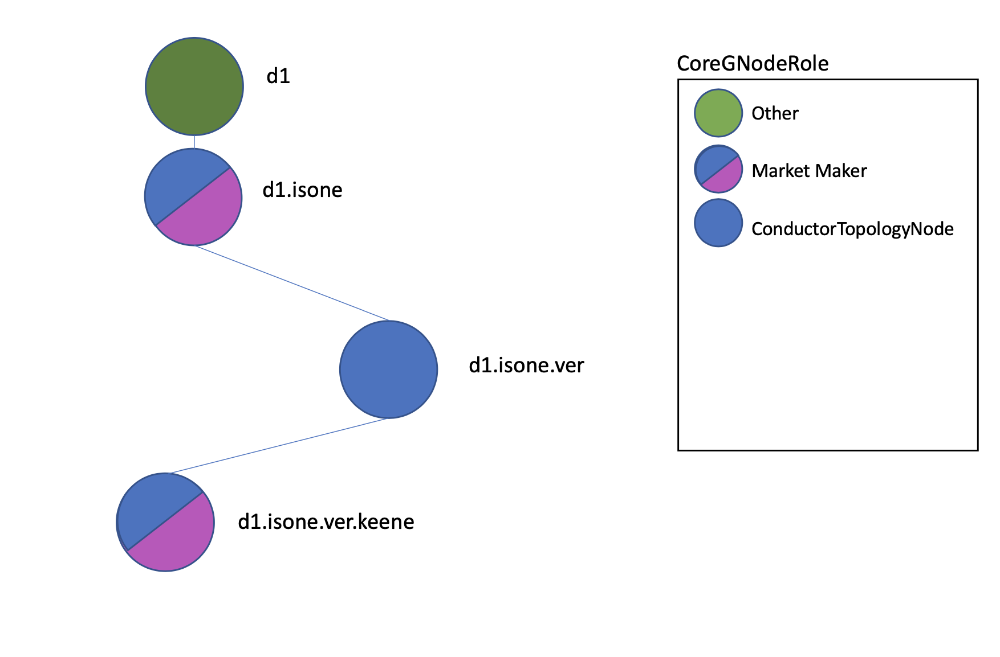

Millinocket Demo Tutorial
==========================

First, `here <https://www.youtube.com/watch?v=a8hCFfaFrok>`_ is  a
non-technical video about Millinocket that is geared towards developers that
can serve as a motication and introduction to this section. Below you will find a series of code
snippets and videos designed to walk you through the
`Millinocket Demo <millinocket-demo.html>`_. It is designed to bring you up to speed on
the infrastructure and domain-specific concepts embedded in GridWorks APIs, SDKs,
and repos.

The tutorial is mostly sequential - you must implement earlier steps to complete later steps.

Demo Prep
---------
1. You will need Python 3.10 or higher, and `docker <https://docs.docker.com/get-docker/>`_.

2. Make a demo folder and clone these 4 repositories inside it:
  - `gridworks-atn <https://github.com/thegridelectric/gridworks-atn>`_
  - `g-node-factory <https://github.com/thegridelectric/g-node-factory>`_
  - `gridworks-marketmaker <https://github.com/thegridelectric/gridworks-marketmaker>`_
  - Algorand `sandbox <https://github.com/algorand/sandbox>`_

.. code-block:: python

   - YourDemoFolder
     |
     -- gridworks-atn
     -- g-node-factory
     -- gridworks-marketmaker
     -- sandbox


3. Install Python environments. At the top level of each of the 3 GridWorks repos, do this:

.. code-block:: python

    python -m venv venv
    source venv/bin/activate
    pip install -e .

4. Start the Algorand sandbox in dev mode. In the sandbox repo:

.. code-block:: python

   ./sandbox up dev

This takes a few minutes to initiate.

5. Start the RabbitMQ broker. In the gridworks-atn repo:

.. code-block:: python

   ./x86.yml   # if you have an x86 chip
   ./arm.yml # if you have an arm chip

The broker takes a few minutes to initiate. Check that it is up at the admin web page http://0.0.0.0:15672/#/,  password and username both `smqPublic`

You can now either continue step by step through what is happening directly below, or skip forward to
the end to `run the full demo <millinocket-tutorial.html#run-the-simulation>`_.

TaValidator Certification
--------------------------

TaValidator Certification Step 1
^^^^^^^^^^^^^^^^^^^^^^^^^^^^^^^^^

In order to run the simulation, `TerminalAssets <terminal-asset.html>`_ need to be created by the
`GNodeFactory <g-node-factory.html>`_.  This involves a `TaValidator <ta-validator.html>`_ issuing
`TaDeeds <ta-deed.html>`_.  So the first step in the simulation is to create a TaValidator. That
is what we walk through in the first couple sections of this demo, with a simulated entity called MollyMetermaid.

**Step 1** Prepare a request to send to the GNodeFactory's RestAPI.

Molly does this by creating a
`tavalidatorcert.algo.create <apis/types.html#tavalidatorcertalgocreate>`_ JSON object, using
the corresponding Python class `TaValidatorcertAlgoCreate <types/tavalidatorcert-algo-create.html>`_.
We will walk
through this step by step, introducing patterns and methods used in GridWorks packages as they come
up for the first time. Do this all at the top level of the gridworks-atn repo, in a Python REPL.

.. code-block:: python
    :caption: Make a tavalidatorcert.algo.create JSON object

    import gwatn.config as config

    settings = config.ValidatorSettings()
    assert settings.cert_name == 'Molly Metermaid'
    assert settings.sk.get_secret_value() == 'FCLmrvflibLD6Deu3NNiUQCC9LOWpXLsbMR/cP2oJzH8IT4Zu8vBAhRNsXoWF+2i6q2KyBZrPhmbDCKJD7rBBg=='

GridWorks uses the dotenv package and pydantic BaseSettings to handle environment variables.
Default dev settings will be defined in the **src/[pckg-name]/config.py** file. In this example,
ValidatorSettings (for the dev TaValidator MollyMetermaid) can be found in
**gridworks-atn/src/gwatn/config.py**.


.. code-block:: python
    :caption: (cont from above)

    import gridworks.algo_utils as algo_utils
    import gwatn.config as config
    from gwatn.dev_utils import DevValidator

    molly = DevValidator(config.ValidatorSettings())
    assert molly.acct.addr == "7QQT4GN3ZPAQEFCNWF5BMF7NULVK3CWICZVT4GM3BQRISD52YEDLWJ4MII"

    multi_addr = molly.validator_multi.addr
    assert multi_addr == "Y5TRQXIJHWJ4OHCZSWP4PZTCES5VWOF2KDTNYSMU5HLAUXBFQQDX6IR5KM"
    assert algo_utils.algos(molly.acct.addr) > 0
    assert algo_utils.algos(multi_addr) == 100


On initialization, the DevValidator actor funds its account using a randomly chosen genesis acct from the sandbox.
After that, the DevValidator funds the 2-signature MultiAccount as described `here <hello-gridworks.html#hello-algorand>`_.
Examine the DevValidator init `here <https://github.com/thegridelectric/gridworks-atn/blob/dev/src/gwatn/dev_utils/dev_validator.py#L31-L57>`_.

AlgodClient is the algosdk wrapper for sending messages to the blockchain. GridWorks Python actors objects will typically
have a **self.client** object of type AlgodClient. For example,
after running the above:

.. code-block:: python
    :caption: (cont from above)

    molly.client.account_info(multi_addr)

    # RETURNS

    {'address': 'Y5TRQXIJHWJ4OHCZSWP4PZTCES5VWOF2KDTNYSMU5HLAUXBFQQDX6IR5KM',
    'amount': 100000000,
    'amount-without-pending-rewards': 100000000,
    'apps-local-state': [],
    'apps-total-schema': {'num-byte-slice': 0, 'num-uint': 0},
    'assets': [],
    'created-apps': [],
    'created-assets': [],
    'min-balance': 100000,
    'pending-rewards': 0,
    'reward-base': 0,
    'rewards': 0,
    'round': 3,
    'status': 'Offline',
    'total-apps-opted-in': 0,
    'total-assets-opted-in': 0,
    'total-created-apps': 0,
    'total-created-assets': 0}


Returning now to the objective of this session, which is having Molly create a
`tavalidatorcert.algo.create <apis/types.html#tavalidatorcertalgocreate>`_ JSON object, using
the corresponding Python class `TaValidatorcertAlgoCreate <types/tavalidatorcert-algo-create.html>`_.

.. code-block:: python
    :caption: Make a tavalidatorcert.algo.create JSON object

    import gridworks.algo_utils as algo_utils
    import gridworks.api_utils as api_utils
    from algosdk import encoding
    from algosdk.future import transaction

    import gwatn.config as config
    from gwatn.dev_utils import DevValidator
    from gwatn.types import TavalidatorcertAlgoCreate


    molly = DevValidator(config.ValidatorSettings())

    txn = transaction.AssetCreateTxn(
        sender=molly.validator_multi.address(),
        total=1,
        decimals=0,
        default_frozen=False,
        manager=molly.settings.public.gnf_admin_addr,
        asset_name=molly.settings.cert_name,
        unit_name="VLDTR",
        note=molly.settings.name,
        sp=molly.client.suggested_params(),
    )

    mtx = molly.validator_multi.create_mtx(txn)
    mtx.sign(molly.acct.sk)

    payload = TavalidatorcertAlgoCreate(
        ValidatorAddr=molly.acct.addr,
        HalfSignedCertCreationMtx=encoding.msgpack_encode(mtx),
    )

    print(payload.as_type())

In the above, Molly:
  * Makes an transaction for creating an Algorand Standard Asset that meets the criterion for being a `TaValidatorCert <ta-validator.html#tavalidator-certificate>`_;
  * Uses her 2-signature MultiAccount [GnfAdminAddr, molly.acct.addr] to make a MultiTransaction (or mtx) out of that transaction;
  * Adds her signature to the mtx; and
  * Finally, makes the JSON payload that she plans to send to the GNodeFactory API.

Your printed statement should look something like the example provided at the end of the  `tavalidatorcert.algo.create <apis/types.html#tavalidatorcertalgocreate>`_ API specification.

Concrete Types Example
^^^^^^^^^^^^^^^^^^^^^^^

We use the output of the previous section to go into more detail about the mechanics of GridWorks Types.

The ```TavalidatorcertAlgoCreate``` Python class runs a number of validation checks. It does the basics of
checking all required properties exist and have the correct Python type. It then does checks on the format
of the properties and also checks additional axioms. The axioms can involve a single property (for example,
checking the type of the ALgorand transaction encoded in the ```HalfSignedCertCreationMtx``` property )
or multiple properties (for example, that the ```ValidatorAddr``` signed the ```HalfSignedCertCreationMtx``` ).
These formats and axioms are described in the API:

.. code-block:: python
    :caption: Formats and axioms in tavalidatorcert.algo.create

    "formats": {
        "AlgoAddressStringFormat": {
        "type": "string",
        "description": "String of length 32, characters are all base32 digits.",
        "example": "RNMHG32VTIHTC7W3LZOEPTDGREL5IQGK46HKD3KBLZHYQUCAKLMT4G5ALI"
        },
        "AlgoMsgPackEncoded": {
        "type": "string",
        "description": "Error is not thrown with algosdk.encoding.future_msg_decode(candidate)",
        "example": "gqRtc2lng6ZzdWJzaWeSgaJwa8Qgi1hzb1WaDzF+215cR8xmiRfUQMrnjqHtQV5PiFBAUtmConBrxCD8IT4Zu8vBAhRNsXoWF+2i6q2KyBZrPhmbDCKJD7rBBqFzxEAEp8UcTEJSyTmgw96/mCnNHKfhkdYMCD5jxWejHRmPCrR8U9z/FBVsoCGbjDTTk2L1k7n/eVlumEk/M1KSe48Jo3RocgKhdgGjdHhuiaRhcGFyhaJhbq9Nb2xseSBNZXRlcm1haWSiYXXZKWh0dHA6Ly9sb2NhbGhvc3Q6NTAwMC9tb2xseWNvL3doby13ZS1hcmUvoW3EIItYc29Vmg8xftteXEfMZokX1EDK546h7UFeT4hQQFLZoXQBonVupVZMRFRSo2ZlZc0D6KJmdlGjZ2VuqnNhbmRuZXQtdjGiZ2jEIC/iF+bI4LU6UTgG4SIxyD10PS0/vNAEa93OC5SVRFn6omx2zQQ5pG5vdGXEK01vbGx5IEluYyBUZWxlbWV0cnkgU3VydmV5b3JzIGFuZCBQdXJ2ZXlvcnOjc25kxCDHZxhdCT2TxxxZlZ/H5mIku1s4ulDm3EmU6dYKXCWEB6R0eXBlpGFjZmc="
        }
    },
    "axioms": {
        "Axiom1": {
        "title": "Is correct Multisig",
        "description": "Decoded HalfSignedCertCreationMtx must have type MultisigTransaction from the 2-sig MultiAccount [GnfAdminAddr, ValidatorAddr], signed by ValidatorAddr.",
        "url": "https://gridworks.readthedocs.io/en/latest/g-node-factory.html#gnfadminaddr"
        },
        "Axiom2": {
        "title": "Is AssetConfigTxn",
        "description": "The transaction must have type AssetConfigTxn."
        },
        "Axiom3": {
        "title": "Is TaValidatorCert",
        "description": "For the asset getting created: Total is 1, Decimals is 0, UnitName is VLDTR, Manager is GnfAdminAddr, AssetName is not blank.",
        "url": "https://gridworks.readthedocs.io/en/latest/ta-validator.html#tavalidator-certificate"
        },
        "Axiom5": {
        "title": "Uniqueness",
        "description": "There must not already be a TaValidatorCert belonging to the 2-sig [GnfAdminAddr, ValidatorAddr] address."
        }
    }

Perhaps the simplest way to understand this is to make a failing example. Axiom 3 states the requirements
for a TaValidatorCert. Let's see what
happens if we set ```total=2``` for the Algorand Standard Asset proposed for co-creation with the
GNodeFactory (which means it would not be a Non-fungible Token).

.. code-block:: python
    :caption: (continued from above)

    txn = transaction.AssetCreateTxn(
        sender=molly.validator_multi.address(),
        total=2,
        decimals=0,
        default_frozen=False,
        manager=molly.settings.public.gnf_admin_addr,
        # asset_name=molly.settings.cert_name,
        unit_name="VLDTR",
        note=molly.settings.name,
        sp=molly.client.suggested_params(),
    )

    mtx = molly.validator_multi.create_mtx(txn)
    mtx.sign(molly.acct.sk)

    payload = TavalidatorcertAlgoCreate(
        ValidatorAddr=molly.acct.addr,
        HalfSignedCertCreationMtx=encoding.msgpack_encode(mtx),
    )

.. code-block:: python
    :caption: Results in ...

    ValidationError: 1 validation error for TavalidatorcertAlgoCreate
    HalfSignedCertCreationMtx
    Axiom 3: TaValidatorCert ASA Total must be 1,  got 2. See https://gridworks.readthedocs.io/en/latest/ta-validator.html#tavalidator-certificate (type=value_error)


TaValidator Certification Step 2
^^^^^^^^^^^^^^^^^^^^^^^^^^^^^^^^^

In this section, MollyMetermaid sends the payload she built in Step 1 to the GNodeFactory API. Start up
the GNodeFactory by going to the **g-node-factory** repo (top level) and running ```./uvi.sh```. This uses
uvicorn to start the GNodeFactory and its RestAPI. Check http://0.0.0.0:8000/settings/
to see that it is working.

Start with `this codeblock </millinocket-demo.html#id8>`_ from section 1 above, and then add the following:

.. code-block:: python
    :caption: Post tavalidatorcert.algo.create JSON object to GNodeFactory RestAPI

    import requests
    api_endpoint = (
            f"{molly.settings.public.gnf_api_root}/tavalidatorcert-algo-create/"
        )
    r = requests.post(url=api_endpoint, json=payload.as_dict())

    print(r.json())


.. code-block:: python
    :caption: Results in ...

    {
        'Note': 'ValidatorCert for ..WJ4MII created, asset_idx 4 \n tx_id CIJ6VVCNY5OK5INJ2443ZRZAUISBHW756BFMFFVSE7V5MHY6J7LQ',
        'HttpStatusCode': 200,
        'PayloadTypeName': 'int',
        'PayloadAsDict': {'Value': 4}
    }

If the posted json is not valid, the GNodeFactory will return a 422 response with details about the error.
Under the hood, this is made easy by the fact that all GridWorks APIs are built with FastAPI, and both FastAPI
and the GridWorks Type SDKs use pydantic. We test this out using the encoded Multitransaction from above for
making an ASA with total=2.

.. code-block:: python
    :caption: Posting an invalid type to the GNodeFactory API

    d = {
    "ValidatorAddr": "7QQT4GN3ZPAQEFCNWF5BMF7NULVK3CWICZVT4GM3BQRISD52YEDLWJ4MII",
    "HalfSignedCertCreationMtx": "gqRtc2lng6ZzdWJzaWeSgaJwa8Qgi1hzb1WaDzF+215cR8xmiRfUQMrnjqHtQV5PiFBAUtmConBrxCD8IT4Zu8vBAhRNsXoWF+2i6q2KyBZrPhmbDCKJD7rBBqFzxEC/ca4yuXu+sP2nK2u+dh2OZEKeB6mpps91gyM6UxiJSFDCwPKrGTv0tbEiT64zrEHZgeQ+MJsBeJiUw0ng2L8Io3RocgKhdgGjdHhuiaRhcGFyg6FtxCCLWHNvVZoPMX7bXlxHzGaJF9RAyueOoe1BXk+IUEBS2aF0AqJ1bqVWTERUUqNmZWXNA+iiZnYEo2dlbqpzYW5kbmV0LXYxomdoxCBkYNLJIfYcRidEPehaVSfvteXqIGPdAFiZRGgdclBJEKJsds0D7KRub3RlxCtNb2xseSBJbmMgVGVsZW1ldHJ5IFN1cnZleW9ycyBhbmQgUHVydmV5b3Jzo3NuZMQgx2cYXQk9k8ccWZWfx+ZiJLtbOLpQ5txJlOnWClwlhAekdHlwZaRhY2Zn",
    "TypeName": "tavalidatorcert.algo.create",
    "Version": "000"
    }
    r = requests.post(url=api_endpoint, json=d)

    print(r.json())


.. code-block:: python
    :caption: Results in ...

    {
        'detail': [{'loc': ['body', 'HalfSignedCertCreationMtx'],
        'msg': 'Axiom 3: TaValidatorCert ASA Total must be 1,  got 2. See https://gridworks.readthedocs.io/en/latest/ta-validator.html#tavalidator-certificate',
        'type': 'value_error'}]
    }


TaValidator Certification Step 3
^^^^^^^^^^^^^^^^^^^^^^^^^^^^^^^^^

What the GNodeFactory did after validating the type was:
  - Sign the mtx so it now has its requried set of 2 signatures;
  - Submit the mtx to the blockchain using gridworks.algo_utils `send_signed_mtx <algo-utils.html#gridworks.algo_utils.send_signed_mtx>`_,
  - Return the Id of the newly created TaValidatorCertificate in the Post response (*Note that ids for  Algorand Standard Assets are integers.*)

If you want to inspect the created asset using algosdk, do this:

.. code-block:: python
    :caption:  Inspect created asset

    molly.client.account_info(molly.validator_multi.addr)


Molly has two more steps before she is a TaValidator. The first is opting into her certificate:

.. code-block:: python
    :caption:  Molly opts into her TaValidatorCert

    opt_in_txn = transaction.AssetOptInTxn(
            sender=molly.acct.addr,
            index=4,
            sp=molly.client.suggested_params(),
    )
    signed_txn = opt_in_txn.sign(molly.acct.sk)
    molly.client.send_transaction(signed_txn)

    response = algo_utils.wait_for_transaction(molly.client, signed_txn.get_txid())
    print(response)

You will need to substitute ```index=4``` for the ASA Id returned by your GNodeFactory API.

(*Why does she need to opt in? Because Account Algo requirements increase with the number of ASAs they
hold.*)


Molly completes the process by generating another POST to the GNodeFactory API, this time
for co-signing a  *transfer* of the TaValidatorCert from the 2-signature MultiAccount that created the TaValidatorCert
(and currently owns it) to her
Algorand address. This process is almost identical to Step 1 above,
creating a `tavalidatorcert.algo.transfer <apis/types.html#tavalidatorcertalgotransfer>`_ JSON object, using
the corresponding Python class `TaValidatorcertAlgoTransfer <types/tavalidatorcert-algo-transfer.html>`_,
and posting it to the api endpoint ```0.0.0.0:8000/tavalidatorcert-algo-transfer```.


One thing to note about the validation of these blockchain-related GridWorks types is the depend on the state
of the Blockchain and thus on in particular on *time()
Go to  `gridworks-atn/src/gwatn/dev_utils/dev_validator.py <https://github.com/thegridelectric/gridworks-atn/blob/dev/src/gwatn/dev_utils/dev_validator.py>`_
to see the above implemented in one place.


TaDeed and TaTradingRights
---------------------------

The TaDeeds are interesting in two ways: they are  made by a Multi-Account tying local and global authority together, and in the future they
can *either* be Algorand Standard Assets or Smart Signatures. What is more interesting than the technicalitiies around the TaDeed and the
TaTradingRights is their ramificactions on the rest of GridWorks. You can start reading about that `here <ta-deed.html>`_ and by generally
looking through the `lexicon <lexicon.html>`_ as well as the sections on `physics, <physics.html>`_ ,  `economics , <economics.html>`_,
and `Transactive Energy <transactive>`_.


GridWorks Contracts On-Chain
-----------------------------

The big work of bringing the GridWorks Contracts On-Chain was actually preparing the ground with enough certificates
for the Smart Contracts to have a foundation and connection to the real, physical grid and all the transcactive electric
devices connected to it.


The Dispatch Contract
-----------------------

Establishing Communication
^^^^^^^^^^^^^^^^^^^^^^^^^^^
`This tutorial <https://youtu.be/lznot3klkUU>`_ discusses the graphics from the end of the  `Millinocket Demo <millnocket-demo.hmtl>`_ section,
honing in on the relationship between two central actors in GridWorks: the `AtomicTNode <atomic-t-node.html>`_ and the `Scada <scada.html>`_.
In a nutshell, the AtomicTNode tells the SCADA when to flip relays to turn the power on and off for the underlying Transactive Device that
is sensed and controlled by the SCADA. Saving money and making sure the Transactive Device is honoring its service level agreement (keeping
people warm, in the case of an electric thermal storage heater) is the responsibility of the AtomicTNode. **Except**, of course, that the
SCADA must take over responsibility for controlling the device if the Internet goes down.

What this means is that there are responsibility (money, comfort) that are *shared through time* between the AtomicTNode and the SCADA,
where at any point in time the responsibility belongs to exactly one of the two. Determining which of these two is responsible at any
point in time hinges on the state of communicating between these two actors.
The primary purpose of the Dispatch Contract, therefore, is to serve as a third-party objective umpire about when
these two actors are **Talking With** each other. The AtomicTNode and SCADA send heartbeats to each other as RabbitMQ messages. Each time one
sends a heartbeat to its partner, it also sends a record of the heartbeat to their Dispatch Contract. The Dispatch Contract then stores that
record in a box (BOX STORAGE IS STILL GETTING DEBUGGED)

The Dispatch Contract is also (1) involved in the initial handshake between the SCADA and the AtomicTNode, and (2) will be used for auditing
energy and power transactions.


A note on time stamps. When the AtomicTNode or SCADA sends a record of a heartbeat they just sent, they include the timestamp of sending.
Even though the Dispatch Contract is arbitrating the state of a variable (TalkingWith) through time, it  does not rely on blockchain time
in any way. This is a requirement, since blockchain time can vary. It also works because the state of TalkingWith does not need to be
determined in the present moment but instead is only required for auditing purposes. This means eventual consistency is good enough.

Beaker and the Dispatch Contract
^^^^^^^^^^^^^^^^^^^^^^^^^^^^^^^^^^^

GridWorks `Type APIs <apis/typeshtml>`_ and our work connecting `ABIs with SDKs <api-sdk-abi.html>`_ in order to accurately articulate and formalize
the boundaries between distributed systems (with both semantics and syntax) dovetails very significantly with the work that Algorand has done with
ABIs and additional layers of abstraction. I would like to highlight `beaker <https://github.com/algorand-devrel/beaker/>`_ for how it supports the
evolution of abstraction on the Algorand, with a particular shout-out to its `Fight Club boxes example <https://github.com/algorand-devrel/beaker/blob/master/examples/boxen/application.py>`_
and its nicely commented and written `AMM demo <https://github.com/algorand-devrel/beaker/tree/master/examples/amm>`_ .

`In this video <https://youtu.be/rupb2A8FHGQ>`_ I go over how the Dispatch Contract works by walking through code. The sample code is
in `this directory <https://github.com/thegridelectric/gridworks-atn/tree/dev/tutorial>`_ of the **gridworks-atn** package. Follow set-up instructions
at the beginning of this section.


Run the Simulation
-------------------

1. Start with the instructions from `demo prep <millinocket-tutorial.html#demo-prep>`_ above.

2. In the **g-node-factory** repo, run:

.. code-block:: python

    python millinocket.py

This will reset the Algorand sandbox, flush the GNodeFactory
database, and then start up the GNodeFactory API with the
following GNodes pre-loaded:



(Go `here <core-g-node-role.html>`_ to read more about the Core GNode Roles)

Check http://0.0.0.0:8000/base-g-nodes/ to confirm these 4 BaseGNodes are loaded

3. In the **gridworks-marketmaker** repo, start up the two halves of the Keene Rd MarketMaker. This will require
opening two terminal windows.


.. code-block:: python
    :caption: 3a) API half of the MarketMaker

    ./millinocket_api.sh

Verify that it is working:

- http://localhost:7997/ shows market maker information
- http://localhost:7997/get-time/ shows the current time of the simulation

.. code-block:: python
    :caption: 3b) Rabbit half of the MarketMaker

    python millinocket_mm.py

Verify that it is working:  Look for a queue named **d1.isone.ver.keene-FXXX** at the rabbit broker admin pg http://0.0.0.0:15672/#/queues


4. The final step is done in the **gridworks-atn** repo.

.. code-block:: python
    :caption: From top level of gridworks-atn repo

    python millinocket.py
