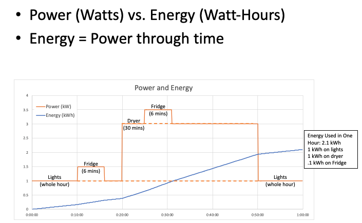
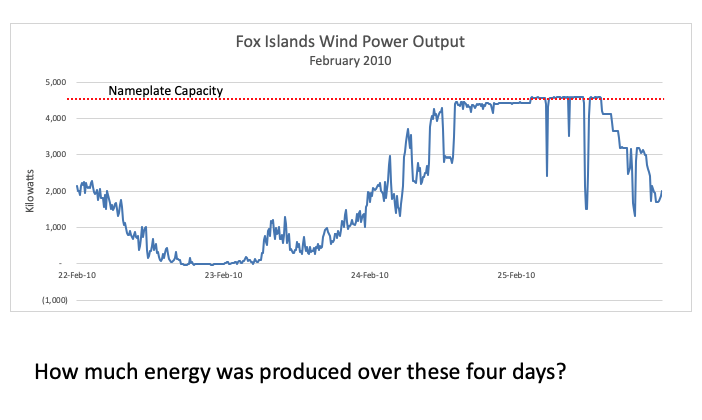
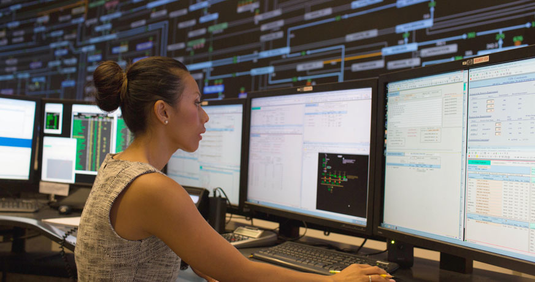
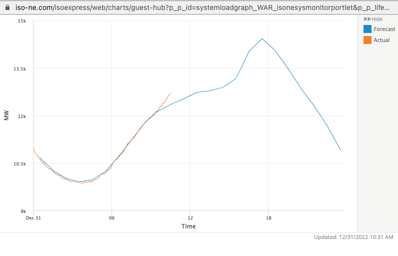
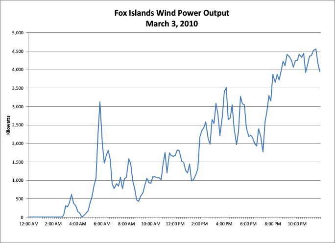

# Physics of the Electric Grid

## Power and Energy

- **Power** is the instantaneous rate of flow of energy
  - Units: Watts, Horsepower, BTUs/hour, Ergs/sec, etc.
  - How powerful is your car? How large is this powerplant?
- **Energy** is power through time
  - Units: Watt-hours, Calories, BTUs, Joules, Foot-pounds, Barrels of Oil Equivalent (BOE), etc.
  - How much energy does it take to drive to New York? How much energy does this powerplant produce in a year?

## What does "grid balancing" mean?

- The grid must be “balanced”
- This means that the instantaneous power of all electric _loads_ connected to the system must exactly equal the instantaneous electric power of all _generators_.
- This also means, of course, that the amount of _energy consumed_ over any period of time must be equal to the amount of _energy generated_ over that time.
  - This is only true if we label the electricity put into storage (e.g. into a battery, an EV, or a hot water heater) as “consumption” and the electricity taken out of storage as “generation.”

**How is the grid kept in balance?**

On a traditional electric grid (that is, one without large amounts of intermittent renewable generation) the control rooms of grid operators “dispatch” generators – that is instruct them to turn on and off, and to modulate their power up and down – so that the amount of electricity generated exactly matches the amount of electricity being consumed: in every second, every minute, every hour, every day, etc.

Grid Operators have elaborate models that help them forecast load hours and even days in advance, and they plan how they will meet this load with precisely the correct amount of generation.

They then react, in real time, when load is not exactly what they planned for, by dispatching more or less generation on a second-by-second basis.

The difficulty of this grid balancing task is exacerbated by the fact that there are several complex feedback loops in grid control that make the system inherently unstable. As Christopher DeMarco, professor of Electrical Engineering at the University of Wisconsin and one of the country’s leading experts on the stability of synchronous electric grids says, “Balancing the grid is a bit like balancing a broom on its handle.”

This process of balancing the grid becomes significantly more complex and difficult when there is a large amount of intermittent renewable generation happening. A wind or solar farm cannot be “turned up” when the electric load increases, and turning down a generator whose output is free seems like an enormous waste of energy.

In addition, neither wind nor solar generate a steady level of power, the way that fossil fuel plants do. When the sun goes behind a cloud, the output of a solar farm can be cut by 80% in seconds. On gusty days, the output of wind farms may fluctuate wildly.

Most experts agree that the only way to keep a grid with a high fraction of intermittent renewable generation balanced is to make the load side of the grid more flexible and responsive: what we call Transactive Energy Management.
