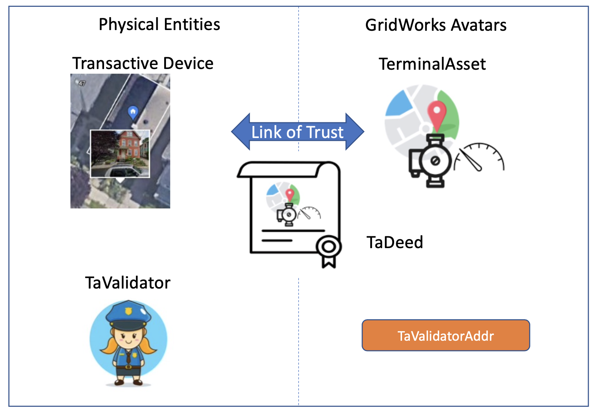

TaDeed
======================

A TaDeed is a blockchain object associating a  `Transactive Device <transactive-device.html>`_ to
its GridWorks avatar, which is a `TerminalAsset <terminal-asset.html>`_. It is analagous in some ways to the deed of a house,
in the way that it establishes ownership of a physical asset. However, it goes beyond establishing ownership, since it
also provides a mechanism for reducing the counterparty risk in trusting the physical meaning of energy transactions.

Link of trust
^^^^^^^^^^^^^^

If you search `blockchain` and `trustless`, you can find a lot of information about how
blockchains enable transactions that do not require the counterparties to trust each other or
a centralized third party. Indeed, this is a foundational feature of blockchains.

But blockchains *do* require trust. Operating with blockchain requires trust that
*collective agreement about the meaning of symbols* will continue to exist. This is true
with any form of currency.  In addition, a person
must have *faith* that the underlying chain itself will remain viable.
Finally, as the Ethereum hard fork demonstrates, collective trust of the
integrity and competence of a single individual within crypto can have profound ramifications.

For GridWorks, there is a global physical entity -- the
electric grid, with all of the electrical devices hanging off of it -- that requires faithful
modeling for GridWorks to support and coordinate the real-time operations
of the grid. The decentralized, hierararchical structure of MarketMakers designed to coordinate
the flow of real electrons on real copper need some reason to **trust**  its blockchain transactions
of energy for money. More specifically, when a MarketMaker examines an `AtomicTNode's <atomic-t-node.html>`_
`DispatchContract <dispatch-contract>`_ for the audit trail of actual energy and power consumed,
there must be some reason for it trust that these are are accurate representations of *what*,  *when*, and
*where* the corresponding `Transactive Device <transactive-device>`_ consumed or provided electricity.

The GridWorks solution to this is a framework allowing for decentralized entities
(`TaValidators <ta-validator.html>`_)
establishing their credentials within a localized area - the geographical locations served by
the grid in the sub-tree under a MarketMaker GNode.  In order to be effective in their role, TaValidators
will  need to have a strong and positive reputation both
  - within the community and/or communities living in that geographical area; and
  - with any other counterparties required to make the MarketMakers run correctly in the existing regulatory environment (typically incumbent companies in the electricity sector: grid operators, utilities, and/or energy suppliers).

These TaValidators establish the
**links of  trust** between Transactive Devices and their
TerminalAssets. Note that a centralized registry must be involved in this process in order
to ensure various uniqueness constraints (bijection between Transactive Devices and TerminalAssets,
unique GNode for any GNodeAlias across time, and unique unique GNodeAlias for any GNode at any
instant of time). This centralized registry is the `GNodeFactory <g-node-factory.html`_, and this is why the creation
of a TaDeed is an act of co-creation (requiring both signatures) between the GNodeFactory and
a TaValidator.

When possible, GridWorks reduces or removes mechanisms that could force or encourage unhelpful patterns
of taking on faith the word and expertise of centralized
authorities. Indeed, the grand GridWorks ambition is to move the heavy lifting of grid control and coordination
*out* of the purview of centralized Grid Operators and into the pruview of a decentralized
hierarchy of MarketMakers.  As another example, *any* entity
can become a TaValidator in GridWorks. This is in contrast to a design decision that, say, would only allow
existing utilities or other large energy companies to authorize Transactive Devices.

That being said, we ignore the physical reality of the copper to our own collective sorrow, a
fact that is dawning slowly as humanity as renewable energy starts to scale and we  begin to incur
the ramifications of mis-aligned regulatory policy.  Therefore, we choose to highlight this necessity
of having a reason to trust the alignment by calling the creation of TaDeed
by a TaValidator a process of creating a  **link of trust** between a real-world device and its
GridWorks avatar.

TaDeed technical details
^^^^^^^^^^^^^^^^^^^^^^^^

A TaDeed can either be an Algorand Standards Asset (ASA), or an Algorand Smart Contract. In either case, the
TaDeed makes publicly available both the `GNodeAlias <g-node-alias.html>`_ of the TerminalAsset, and the
Algorand address of the `TaValidator <ta-validator.html>`_.

Why are there two variants of a TaDeed?

  - On the one hand, ASAs are easier for people learning the ropes with Algorand development. Anyone who has made an NFT will be familiar with the mechanics, and it is easier to track transactions in an online tool like  `Algosearch <https://developer.algorand.org/tutorials/algosearch-setup/>`_.
  - On the other hand, the GNodeAlias length cannot exceed 32 characters fo an ASA TaDeed.  Many TerminalAssets will start with GNodeAliases less than 32 characters, but some will not. In addition, as the online mapping of the  electric grid captured by the set of GNodeAliases expands, a TerminalAsset (which represents a leaf node in that tree) will likely get longer.

There is a practical issue with this: the unique ids for ASAs are ints, and the unique ids for SmartSigs are
strings (their public AlgoAddress).

ASA TaDeed specs
^^^^^^^^^^^^^^^^^

An ASA TaDeed is an Algorand Standard Asset where:
 - `Creator (aka Sender) <https://developer.algorand.org/docs/get-details/transactions/transactions/#sender>`_ is *either*

   - a 2-sig `MultiAddress <https://gridworks.readthedocs.io/en/latest/algo-utils.html#gridworks.algo_utils.MultisigAccount>`_ [`GnfAdminAddr <g-node-factory.html#gnfadminaddr>`_, Addr2] where Addr2 is the public address of a `TaValidator <ta-validator.html>`_ *or*
   - GnfAdminAddr
 - `Total <https://developer.algorand.org/docs/get-details/transactions/transactions/#total>`_ is 1
 - `UnitName <https://developer.algorand.org/docs/get-details/transactions/transactions/#unitname>`_ is "TADEED"
 - `ManagerAddr <https://developer.algorand.org/docs/get-details/transactions/transactions/#manageraddr>`_ is GnfAdminAddr
 - `AssetName <https://developer.algorand.org/docs/get-details/transactions/transactions/#assetname>`_ has the LeftRightDot format, and is no more than 32 characters

SmartSignature TaDeed specs
^^^^^^^^^^^^^^^^^^^^^^^^^^^

`Back to Lexicon <lexicon.html>`_
