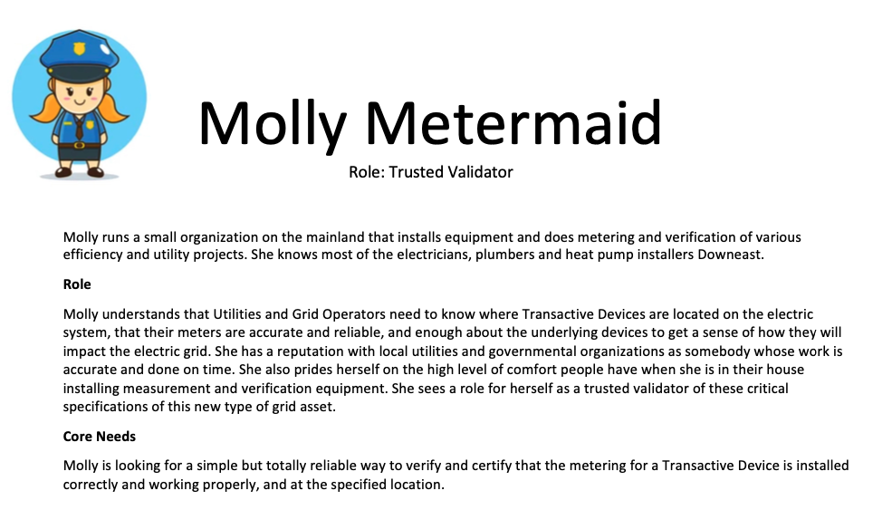
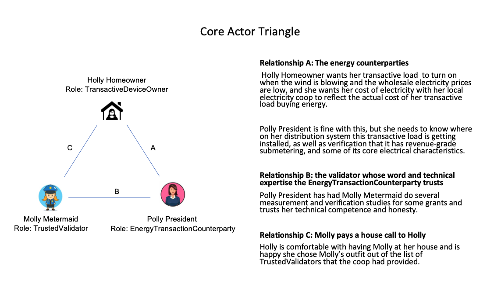
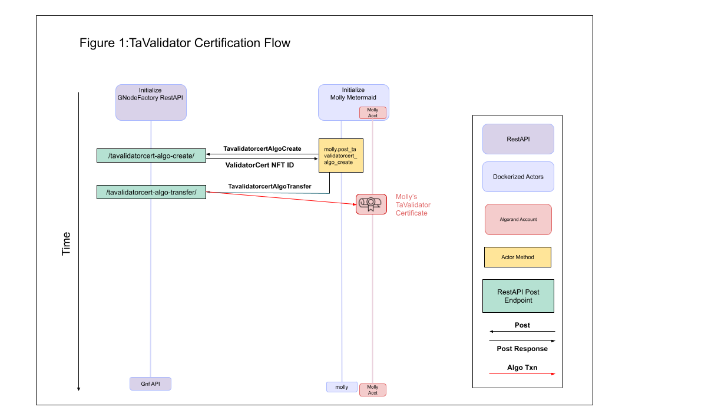

TaValidator
============

A **TaValidator** is an entity authorized to validate `Transactive Devices <transactive-device.html>`_.
Anyone can become a TaValidator, once they have gone through the
validator certification process with the GNodeFactory.

The TaValidator role is a key in establishing the `link of trust <ta-deed.html#link-of-trust.html>`_ between a Transactive Devices
and its `TerminalAsset <terminal-asset.html>`_. In the `Millinocket demo <millinocket-demo.html>`_, the first step is a fictitious entity called
Molly Metermaid becoming a TaValidator.

Who is likely to become a TaValidator? Organizations that provide Measurement and Verification
services to utilities and grid operators are likely candidates. These are organizations involved
in evaluating efficiency progams and Demand Response progams.

TaValidator Certificate
^^^^^^^^^^^^^^^^^^^^^^^^
An entity is a TaValidator exactly if its Algorand address (TaValidatorAddr) owns a TaValidator Certificate.

This certificate is an Algorand Standard Asset meeting the following criteria:
  - `Creator (aka Sender) <https://developer.algorand.org/docs/get-details/transactions/transactions/#sender>`_ is the 2-sig `MultiAddress <https://gridworks.readthedocs.io/en/latest/algo-utils.html#gridworks.algo_utils.MultisigAccount>`_ [GnfAdminAddr, ValidatorAddr]
  - `Total <https://developer.algorand.org/docs/get-details/transactions/transactions/#total>`_ is 1
  - `Decimals <https://developer.algorand.org/docs/get-details/transactions/transactions/#decimals>`_ is 0
  - `UnitName <https://developer.algorand.org/docs/get-details/transactions/transactions/#unitname>`_ is "VLDTR"
  - Manager is GnfAdminAddr
  - AssetName its not blank

Unpacking this a bit.

**Total** An ASA with a total of 1 is an Algorand Non-fungible token, or
`NFT <https://www.algorand.foundation/create#:~:text=Non%2Dfungible%20tokens%2C%20or%20NFTs,surface%20of%20what%20is%20possible.>`_.

**Creator** Typically, Algorand Multisig addresses are used when 2 or more signatures are required to sign transactions. This is how
we use them: *both* the candidate TaValidator *and* the GNodeFactory's Administrative account (with public address
GnfAdminAddr) must sign. That is, they must work together to create the Validator Certificate and transfer it
to the TaValidator's address.

TaValidator Certification Flow
^^^^^^^^^^^^^^^^^^^^^^^^^^^^^^^

Relevant messages:

- TavalidatorcertAlgoCreate (`api <apis/types.html#tavalidatorcertalgocreate>`_ and `sdk <types/tavalidatorcert-algo-create.html>`_)
- TavalidatorcertAlgoTransfer (`api <apis/types.html#tavalidatorcertalgotransfer>`_ and `sdk <types/tavalidatorcert-algo-transfer.html>`_)

`Back to Lexicon <lexicon.html>`_
