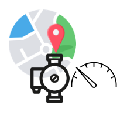

# Terminal Assets

A GNode whose [GNodeRole](g-node-role) is **TerminalAsset** is
a GridWorks avatar for a [Transactive Device](transactive-device), where this bijective link
is established by a [TaDeed](ta-deed). As such, it can be trusted to represent:

- **An electrical device** connected to the grid that can consume and/or produce electrical power;
- **An electrical meter** that meters exactly the TerminalAsset and has the accuracy characteristics required to meet existing and pending grid balancing challenges (that is, the challenge of keeping electric supply and electric demand in balance on various timescales as wind and solar electricity become more prevalent); and
- **A lat/lon pair** that can be used to capture where the electrical device is connected to the topology of the electric grid.

Here is the GridWorks icon used to represent TerminalAssets

_Back to [Lexicon](lexicon.md)_
