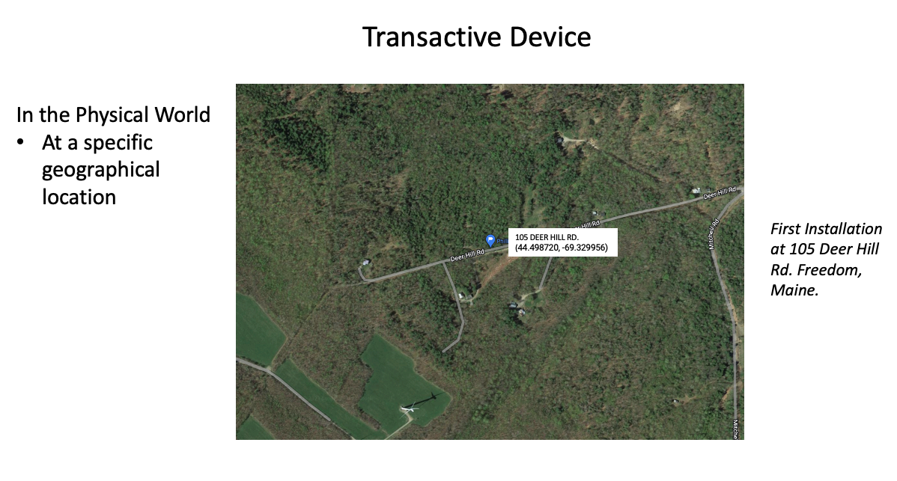
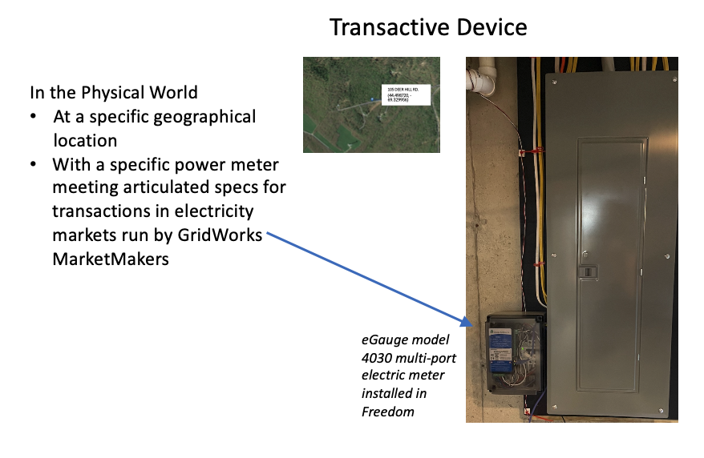
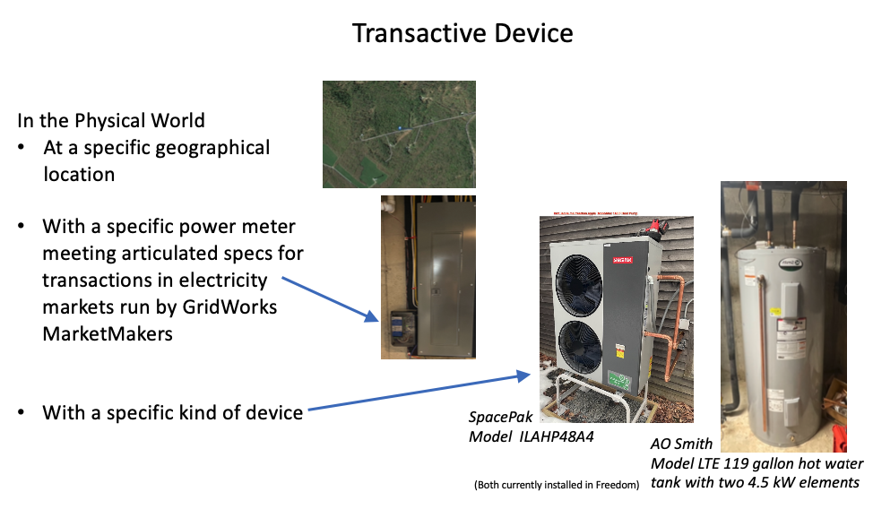

# Transactive Device

A **Transactive Device** is real-world electrical device that is consuming or producing energy [transactively](transactive).
Consider the first [Maine demo](millinocket-demo) installation at the house of one of the demo team members.
The space heating distribution system in their house is an underfloor
heating system on the first floor, and a combination of radiant heat and air on the second. The
distribution system can keep the house warm with water at 120F, even on the coldest day. Plumbed into this is 3
water tanks with 9 kW of resistive boost elements and a Spacepak heat pump with a max draw of 4.5 kW,
capable of producing 135 F water. The heat pump
and resistive elements are metered by an eGauge meter.

In summary, a **Transactive Device** is a tuple of 3 physical things:

- **A geographical location** of the location where the electrical device connects to the electric grid.
- **An electrical meter** that meters exactly the electrical device and has the accuracy characteristics required to meet existing and pending grid balancing challenges (that is, the challenge of keeping electric supply and electric demand in balance on various timescales as wind and solar electricity become more prevalent); and
- **An electrical device** connected to the grid that can consume and/or produce electrical power;

_Back to [Lexicon](lexicon)_
