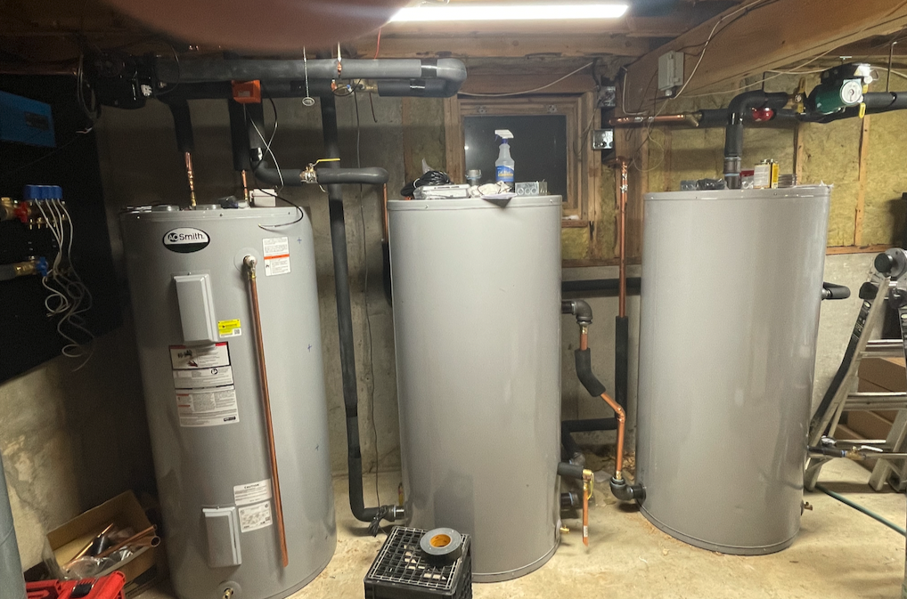

# Transactive Energy and the Grid

## Transactive Energy Resources

We start with definition from the [lexicon](transactive-energy-resource):

A **Transactive Energy Resource** (or TER) is a physical resource capable of 24-7, real-time, geographically localized response to grid conditions that can significantly shift and adapt its pattern of electric power use and/or generation with negligible negative consequences on its primary use.

Aggregations of Transactive Load have the potential to significantly mitigate the problems that are encountered on an electric grid with significant amounts of renewable generation.

- They do this by fundamentally altering the behavior of electric load on the grid, turning it from a fixed burden that must be served by some generator into a powerful and flexible resource that can be used to balance the grid on timescales varying from days to milliseconds.

**What is needed?**

Several things need to change for load to become Transactive and begin to solve the problem of renewables integration on the world’s electric grids.

- The current idea of Demand Response, which involves reducing load during discrete “peak” events, needs to be redefined to mean 24/7 adaptation and adjustment to conditions on the grid.
- Load assets need to be able to communicate in real time with the Grid Operator, weather service, and other sources of information required to operate efficiently and effectively.
- Forward-looking optimization techniques will be required to ensure that load assets can meet the needs of the grid while also fulfilling their primary function.
- A mechanism for distributed, decentralized, secure, and trustless transactions must be developed so that potentially millions of Transactive Energy Resources can interact with each other, the Grid Operator, and end users. This will include the development of new Service Level Agreements between TER Aggregators and end users.

## Service Level Agreements

What is a Service Level Agreement (SLA), and why is it important for transactive energy?

Your current SLA with your electricity supplier is simple: whenever you turn on a switch, or plug in your EV, or the thermostat in your fridge tells the compressor to turn on, or the temperature in your hot water tank goes below some setpoint, you can consume electricity at full power until you turn off the switch, your car is full, your fridge is cold, or your water is hot.

Even though there may be significant flexibility in when your car needs to charge, or your fridge needs to come on, or when you next need hot water, under the current SLA your energy supplier has no flexibility in when it draws power from the grid and delivers it to you.

For traditional Demand Response, you get paid by an Aggregator for occasionally inconveniencing you. This works because it is occasional. But with
transactive energy, the grid interaction is happening 24-7: _all_ decisions
about when to consume electricity are made in the context if it is the cheapest
time to do it.

But cheapest compared to what?

From the perspective of the developers writing code for the [AtomicTNode](https://gridworks-atn.readthedocs.io/en/latest/), the Service Level Agreement contains a _contract_ defining the operating bounds of the AtomicTNode's bidding strategy.

From the perspective of the person paying the bills, the Service Level Agreement articulates what they can expect in terms of the performance of their
device.

The new Service Level Agreements for TERs will allow end users to “sell” the inherent flexibility in many electric devices and appliances to the grid in return for lower energy bills. An SLA for an electric clothes dryer might be something like: when you push the start button, your TER Aggregator guarantees that your clothes will be dry by 7:00 the next morning. If you need them dried right now, you push an override button and for 50¢, your dryer will come on immediately. In return for agreeing to this SLA, you will receive a 25% rebate on all energy consumed by your dryer. A similar SLA for your hot water heater might be that you are guaranteed a full tank at 5:00 AM and 5:00 PM every day; once again if you need to reheat your tank right away, you push an override button and for a small fee you get immediate power.

The thing to recognize is that rarely do consumers care about electric power per se; they care about the services that electrical devices provide: dry clothes; hot water; cold food; transportation when I need it, etc. On the other hand, what matters to the grid is the precise timing of when power is drawn. By allowing Transactive Energy Resources to separate the consumption of electricity from the consumption of the services that electricity provides, these new Service Level Agreements will allow load to become Transactive.

- Note that not all electric loads are good candidates for becoming TERs. Lighting, for instance, is something that you need when you need it and not when you don’t. Nothing but cheap electric storage (a rechargeable battery) will turn lighting into a Transactive Load.

## Transactive Heat

There are many electric loads that are attractive potential TERs, but we believe that the most promising is space heating (both commercial and residential) using heat pumps with thermal storage.

These systems can be designed so that they can deliver enormous flexibility to the grid without sacrificing end-user comfort. The SLA for Transactife space heat looks pretty much like it looks now: the aggregator guarantees that the heating system will hit the thermostat’s setpoint 24/7.

This is possible through the use of thermal storage, either in the form of hot water tanks in the basement, or Phase-Change Materials (which allow for the storage of large amounts of thermal energy in a much smaller volume).

The thermal storage in these systems allow them to buy energy from the grid when it is plentiful and cheap, and keep the building warm for up to 12 hours (on most days) without buying any more energy.

- This type of system requires sophisticated Forward-Looking Optimization techniques, using weather and price forecasts to plan future energy purchases and react in real time to unexpected weather and/or market conditions.

The [Transactive Heat Pilot in Maine](story) will demonstrate the ability of the GridWorks TER platform to keep houses warm, reduce curtailment of wind farms, and lower the cost of home heating for thousands of people in and around Millinocket.

## The Millocket Demo

## In the field

Efficiency Maine is a quasi-governmental organization with a mandate to install 100,000 heat pumps across the state. They are concerned that they do not have a solution that is cost effective and that
can keep up with the coldest days. Therefore, they have funded a pilot project to test out the capabilities of transactive thermal storage heat systems. Over the next year, this will likely be
on the scale of 20 homes. If the solution proves to keep people warm and is cost effective, they
are poised to roll out rapidly at scale after that.

### Freedom ME

To support this real demonstration, GridWorks has developed open-source
[SCADA code](https://github.com/thegridelectric/gw-scada-spaceheat-python) (based on our previous experience at [VCharge](https://www.greentechmedia.com/articles/read/vcharge-turning-hot-bricks-into-grid-batteries), where we designed and deploying SCADA systems as retrofits for thousands of ceramic brick thermal stoage heaters). We have also agreed to build prototype SCADA boxes (built with off-the-shelf parts,
with a raspberry Pi 4 as the brain) for the first several dozen installations.

**Dec 30 2022** The first SCADA is deployed in Freedom Maine! The thermal storage and heat pump have also been installed, waiting on some upgrades to the heat distribution system before going live.

